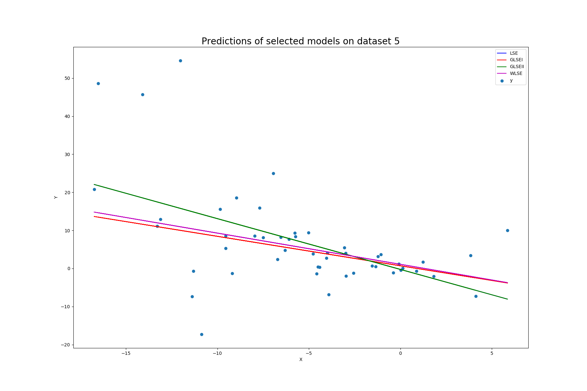

# Heterosked reg models

## Main questions
1. Which metrics other than R^2 we can use to evaluate the performance of our models?
2. What other rgression types efficently deal with heteroskedacity?

## Current Progress

### R^2 table

| file/ reg type            | 1            | 2            | 3             | 4              | 5            |
| ------------------------- | ------------ | ------------ | ------------- | -------------- | ------------ |
| LSE                        | 0.1639863122  | 0.3980894410  | 0.10319995    | 0.0275947359   | 0.280575792    |
| GLSEI                      |  0.1166125126  | 0.09153352884 | -0.01553730364 | -0.1297663105  | -0.1286472674 |
| GLSEII                     | 0.04640626767 | 0.06940218455 | -0.04114628643 | -0.1472103778  | 0.280575792 |
| WLSE                    | 0.1403769574  | 0.1834023549  | 0.01624763418  | -0.01781630477 | -0.04060542850 |
| LASSO                    |0.1639739902  | 0.3980894371 | 0.1031952438   | 0.02759473565  | 0.2805757898 |
| RIDGE                    |0.1638634355 | 0.3980877000  | 0.1031988620   | 0.02670308780  | 0.2805165134 |
| HUBER                     | 0.1573759139  | 0.3937864654  | 0.08307870806  | 0.006033289644 | 0.2581856714   |

### RMSE table 

| file/ reg type | 1                 | 2                  | 3                  | 4                  | 5                  |
|----------------|-------------------|--------------------|--------------------|--------------------|--------------------|
| lSE            | 5.2949701007221 | 15.4237819098164 | 17.5180183493125 | 5.07326984135883 | 11.1023251073797 |
| GLSEI          | 5.4429261248202 | 18.9486967923493 | 18.6416825140806 | 5.468379190303   | 13.9059458626989 |
| GLSEII         | 5.6550768614652 | 19.178114585660  | 18.875264406678  | 5.5104345123976  | 11.1023251073797 |
| WLSE           | 5.3692155871704 | 17.9650717619072 | 18.347633724117  | 5.1903783156856  | 13.3525576166922 |
| LASSO          | 5.2950091220463 | 15.423781960821  | 17.5180643853534 | 5.0732698420786  | 11.1023251290293 |
| HUBER          | 5.2953592119916 | 15.4238042169278 | 17.518029046899  | 5.0755952787186  | 11.1027825033413 |
| RIDGE          | 5.3158626672572 | 15.4788149751225 | 17.71345162456   | 5.1292070631290  | 11.2737662497784 |

## Model predictions
#### File 1

#### File 2

#### File 3

#### File 4

#### File 5

